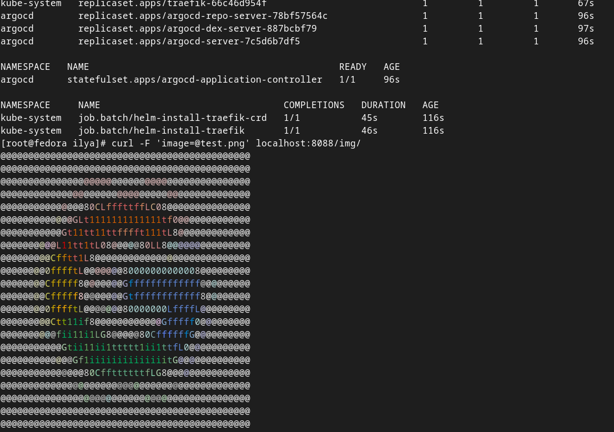

# Deploying applications to Kubernetes with ArgoCD

Argo CD automates the deployment of the desired application states in the specified target environments. Application deployments can track updates to branches, tags, or pinned to a specific version of manifests at a Git commit.

## Install and Setup ArgoCD

1. Install the ArgoCD operator by running the following command:

```
kubectl create namespace argocd
kubectl apply -n argocd -f https://raw.githubusercontent.com/argoproj/argo-cd/stable/manifests/install.yaml
```

2. Expose the ArgoCD server by running the following command:

```kubectl port-forward svc/argocd-server -n argocd 8080:443```

3. Getting password for user "admin": 

```kubectl -n argocd get secrets argocd-initial-admin-secret -o jsonpath="{.data.password}" | base64 -d; echo```

5. Log in to the ArgoCD web interface using the default username.

## Deploying Applications with ArgoCD

Once ArgoCD is set up, you can dumb down to deploy the application. The following steps allow you to automate the deployment.

1. The repository on GitHub will be used for the demonstration: 

```https://github.com/den-vasyliev/go-demo-app```

2. We will create a manifest in YAML format, the file describes the different parameters for deploying the application: 

```
    ---
    apiVersion: argoproj.io/v1alpha1
    kind: Application
    metadata:
      name: demo
    spec:
      destination:
        name: ''
        namespace: demo
        server: 'https://kubernetes.default.svc'
      source:
        path: helm
        repoURL: 'https://github.com/den-vasyliev/go-demo-app'
        targetRevision: HEAD
      sources: []
      project: default
      syncPolicy:
        automated:
          prune: true
          selfHeal: true
        syncOptions:
          - CreateNamespace=true
```

3. Apply the created manifest file:

    ```kubectl apply -n argocd -f application.yaml```

5. Subsequent updates of the repository will lead to an automatic update of the application

## Demo

[](https://asciinema.org/a/584474)
